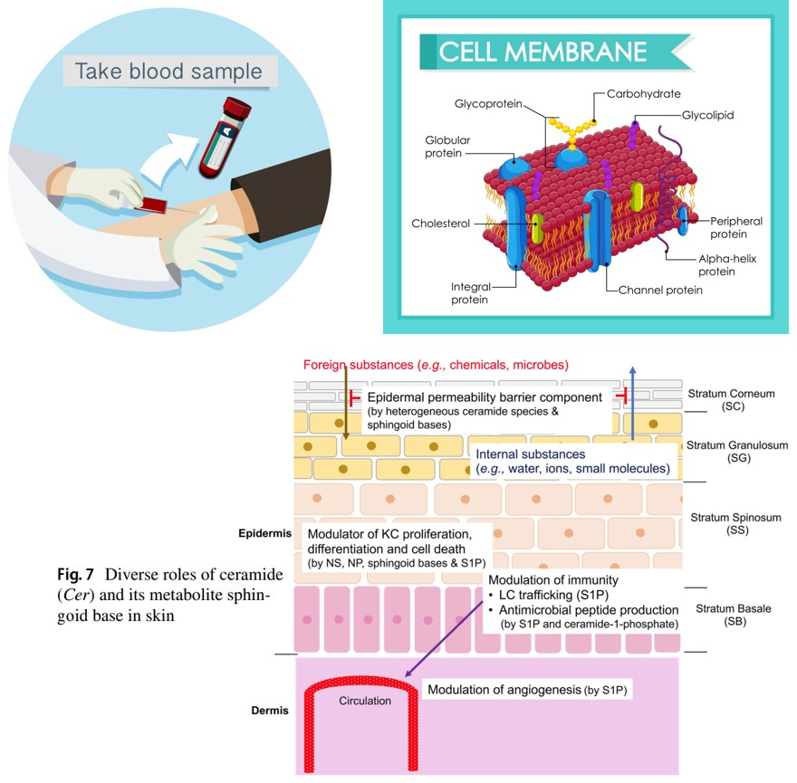
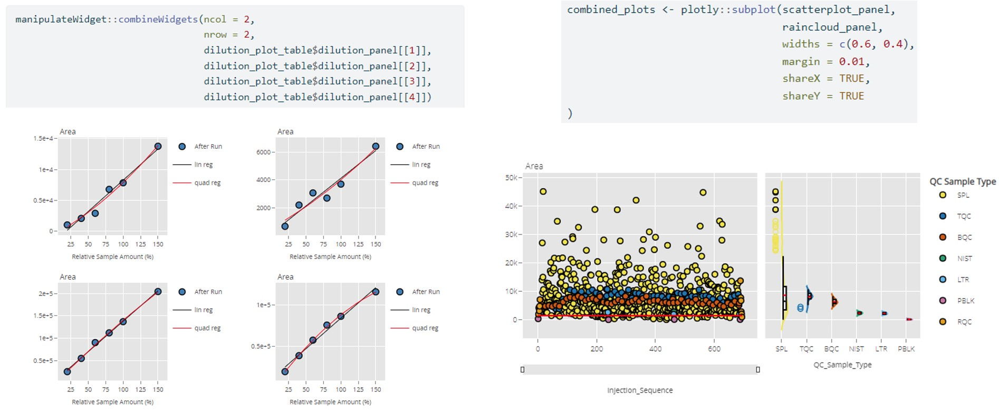

```{r setup, include=FALSE}
options(htmltools.dir.version = FALSE)
knitr::opts_chunk$set(echo = FALSE, fig.align = "center", out.width = "90%")
library(glue)
library(fontawesome)
library(metathis)
library(webshot2)
library(xaringanthemer)
library(xaringanExtra)

xaringanExtra::use_slide_tone()
xaringanExtra::use_webcam()
xaringanExtra::use_fit_screen()
xaringanExtra::use_tile_view()
# xaringanExtra::embed_xaringan(
#  url = "https://jauntyjjs.github.io/RMedicine2022",
#  ratio = "16:9"
# )
xaringanExtra::use_share_again()
```


```{r screenshot, include=FALSE}
#' Screenshot Your Title Slide for Share Image
#'
#' Takes a screenshot of your title slide for sharing on Twitter
#' (and other social media sites).
#'
#' @param slides_rmd Your slides file
#' @param path Path to new share image
screenshot_share_image <- function(
  slides_rmd,
  path_image = "share-card.png"
) {
  if (!requireNamespace("webshot2", quietly = TRUE)) {
    stop(
      "`webshot2` is required: ", 
      'remotes::install_github("rstudio/webshot2")'
    )
  }
  
  webshot2::rmdshot(
    doc = slides_rmd,
    file = path_image,
    vheight = 600,
    vwidth = 600 * 191 / 100,
    rmd_args = list(
      output_options = list(
        nature = list(ratio = "191:100"),
        self_contained = TRUE
      )
    )
  )
  
  path_image
}

#screenshot_share_image("index.Rmd")
```


```{r xaringan-themer, include=FALSE, warning=FALSE}
xaringanthemer::style_mono_accent(
  base_color = "#3b1260",
  header_font_google = xaringanthemer::google_font("Josefin Sans", "300"),
  text_font_google   = xaringanthemer::google_font("Montserrat", "600", "600i"),
  code_font_google   = xaringanthemer::google_font("Fira Mono"),
  code_inline_color = "#0098db",
  inverse_link_color = "#bbf3dc",
  link_color = "#0072bb",
  footnote_color = NULL,
  footnote_font_size = "0.6em",
  footnote_position_bottom = "10px",
)
```

```{r metathis, echo=FALSE}
meta() %>%
  meta_name("github-repo" = "JauntyJJS/RMedicine2022") %>% 
  meta_social(
    title = "Viewing Multiple Inteactive Plots Using Plotly and Trelliscopejs",
    description = glue::glue("
    Presented at R/Medicine 2022. 
    "),
    url = "https://jauntyjjs.github.io/RMedicine2022",
    image = "https://raw.githubusercontent.com/JauntyJJS/RMedicine2022/main/share-card.png",
    image_alt = glue::glue("
      Title slide of Viewing Multiple Inteactive Plots Using \\
      Plotly and Trelliscopejs presented at R/Medicine 2022.
      "),
    og_type = "website",
    og_author = "Jeremy Selva",
    twitter_card_type = "summary_large_image",
    twitter_creator = "@JauntyJJS"
  )
```


class: middle, center, inverse

# Viewing Multiple Inteactive Plots Using [`plotly`](https://plotly.com/r/) and [`trelliscopejs`](https://hafen.github.io/trelliscopejs/)

.pull-left[
```{r out.width = "53%"}
#| fig.alt = "Figure showing the R Medicine 2022 Conference logo."

knitr::include_graphics("images/RMedicine_logo.JPG")
```

### R/Medicine 2022 [`r fa(name = "link")`](https://jeremy-selva.netlify.app/)
]

.pull-right[
```{r, out.width = "100%"}
#| fig.alt = "Figure showing the Injection Sequence Plot in trelliscopejs"

knitr::include_graphics("images/title.JPG")
```

### Jeremy Selva [`r fa(name = "github")`](https://github.com/JauntyJJS) [`r fa(name = "linkedin")`](https://www.linkedin.com/in/jeremy-selva-085b9112a/) [`r fa(name = "link")`](https://jeremy-selva.netlify.app/) [`r fa(name = "twitter")`](https://twitter.com/JauntyJJS)

]

.left[
.footnote[

[Xaringan](https://github.com/yihui/xaringan) Slide Template by [Sharla Gelfand](https://github.com/sharlagelfand/sharstudioconf) [`r fa(name = "github")`](https://github.com/sharlagelfand) [`r fa(name = "link")`](https://sharla.online) [`r fa(name = "twitter")`](https://twitter.com/sharlagelfand) [`r fa(name = "youtube-square")`](https://www.youtube.com/watch?v=JThd3YYQXGg)
]
]

.center[.footnote[https://jauntyjjs.github.io/RMedicine2022 [`r fa(name = "link")`](https://jauntyjjs.github.io/RMedicine2022) [`r fa(name = "github")`](https://github.com/JauntyJJS/RMedicine2022) [`r fa(name = "file-pdf")`](https://jauntyjjs.github.io/RMedicine2022/index.pdf)]
]

---
## Introduction to Lipids

.pull-left[
Lipids are organic compounds that are mostly insoluble in polar solvents like water.

Example of lipids are
 * Cholesterol and Triglycerides in blood lipid panel test
 
 * Phospholipids in cell membrane
 
 * Ceramides in skin
]

.pull-right[
```{r, out.width = "95%"}
#| fig.alt = 
#| "Figures showing examples where lipids can be found.\n
#| First figure on the top left is a picture of a trained medical professional drawing blood samples from a person's arm symbolising a blood lipid panel test.\n
#| Lipids like cholesterol and triglycerides are usually measured in the blood lipid panel test.\n
#| Second figure on the top right is a picture of a cell membrane displayed as a lipid bilayer made up of mainly phospholipids as well as other lipids like cholesterol and glycolipids.\n 
#| Third Figure at the bottom shows the diverse role of ceramides and its metabolite sphingoid base in skin. Ceramides can be found in the outermost layer of the skin, serving as barrier protection against chemical or microbes. At the epidermis layer of the skin, ceramides assist in the role of cell differentiation and wound healing. Finally at the dermis layer of the skin, cell signaling roles of ceramide and its metabolites modulate immunity functions in the skin."


```
]

.left[
.footnote[
Blood sample and cell membrane images from [brgfx](https://www.freepik.com/vectors/cell-membrane)

Skin image from [Uchida and Park 2021](https://link.springer.com/article/10.1007/s40257-021-00619-2)
]
]

.center[.footnote[https://jauntyjjs.github.io/RMedicine2022 [`r fa(name = "link")`](https://jauntyjjs.github.io/RMedicine2022) [`r fa(name = "github")`](https://github.com/JauntyJJS/RMedicine2022) [`r fa(name = "file-pdf")`](https://jauntyjjs.github.io/RMedicine2022/index.pdf)]
]

---
## How Lipids are measured (Targeted Lipidomics)

```{r, out.width = "90%"}
#| fig.alt = 
#| "Figure showing the workflow of how lipids are measured in a targeted lipidomics settings.\n
#| Samples are first converted to lipid extracts. From a given list of transitions to measure, lipids in the extracts are measured using liquid chromatography and mass spectrometry. In the example, a transition from an internal standard Ceramide d 18 1 12 0 is measured. This results in chromatogram peaks which the user needs to 
#| integrate the area under curve.\n
#| In the case of the internal standard Ceramide d 18 1 12 0, it is four hundred and seventy nine thousand and twenty five.\n 
#| After the peaks are integrated for all samples and transtions, the peak area data are exported for further processing."

knitr::include_graphics("images/Targeted_Lipidomics.JPG")
```

.center[.footnote[https://jauntyjjs.github.io/RMedicine2022 [`r fa(name = "link")`](https://jauntyjjs.github.io/RMedicine2022) [`r fa(name = "github")`](https://github.com/JauntyJJS/RMedicine2022) [`r fa(name = "file-pdf")`](https://jauntyjjs.github.io/RMedicine2022/index.pdf)]
]


---
## Source of "Unwanted" Variation
* Lipid Extraction
  * Different pipettes used to do extraction.
  
* Lipid Measurement
  * Contaminant ions
  
```{r, out.width = "90%"}
#| fig.alt = 
#| "Figure showing the stages in the targeted lipidomics settings in which
#|  unwanted or non sample related variation can occur. It is usually during the 
#|  stage of lipid extraction or measurement."
#| 
knitr::include_graphics("images/Unwanted_Variation.JPG")
```

.center[.footnote[https://jauntyjjs.github.io/RMedicine2022 [`r fa(name = "link")`](https://jauntyjjs.github.io/RMedicine2022) [`r fa(name = "github")`](https://github.com/JauntyJJS/RMedicine2022) [`r fa(name = "file-pdf")`](https://jauntyjjs.github.io/RMedicine2022/index.pdf)]
]

---
## Quality Control (QC) Samples

Quality control samples helps to check the severity of unwanted variation. 

One example is the Batch Quality Control (BQC) to measure variation during lipid extraction and measurement.

```{r, out.width = "100%"}
#| fig.alt = 
#| "Two figures showing what is a batch quality control (BQC).\n
#| Left figure shows how the BQC samples are created. They are created by first pooling the sample aliquots. 
#| The pooled sample is then aliquoted into new eppendorf tubes. These aliquoted pooled samples in the eppendorf tubes are the BQC samples.\n
#| Right figure shows where in the injection sequence are the BQC samples placed. They are usually placed before the first sample, in between samples at regular intervals, for example every five samples, and after the last sample."
 
knitr::include_graphics("images/BQC_Intro.JPG")
```

.left[.footnote[Pooled sample image from [Broadhurst et. al. 2018](https://doi.org/10.1007/s11306-018-1367-3)]]

.center[.footnote[https://jauntyjjs.github.io/RMedicine2022 [`r fa(name = "link")`](https://jauntyjjs.github.io/RMedicine2022) [`r fa(name = "github")`](https://github.com/JauntyJJS/RMedicine2022) [`r fa(name = "file-pdf")`](https://jauntyjjs.github.io/RMedicine2022/index.pdf)]
]


---
## Quality Control Plot

An injection sequence bar chart with some statistical summary is created for each transition. Keep transitions with high BQC coefficient of variation (CV).

Report results as a pdf file of injection sequence bar charts. (One transition per page)

```{r, out.width = "90%"}
#| fig.alt = 
#| "Figure showing an injection sequence of internal standard Ceramide d 18 1 12 0 as a bar chart.\n 
#| The y axis is peak area while the x axis is the injection sequence. The different colours on the bar chart repsresent the different QC sample type. The important ones are the ones in blue representing the BQC.\n
#| The coefficient of variation of the BQC is around 0.09 which is a low value. Hence, the internal standard Ceramide d 18 1 12 0 has a low interference from unwanted sources. This injection sequence bar chart is exported as a pdf file."


```

.left[.footnote[PDF image from [Wikimedia](https://commons.wikimedia.org/wiki/Category:PDF_icons)]]

.center[.footnote[https://jauntyjjs.github.io/RMedicine2022 [`r fa(name = "link")`](https://jauntyjjs.github.io/RMedicine2022) [`r fa(name = "github")`](https://github.com/JauntyJJS/RMedicine2022) [`r fa(name = "file-pdf")`](https://jauntyjjs.github.io/RMedicine2022/index.pdf)]
]


---
## Motivation for using [`plotly`](https://plotly.com/r/) and [`trelliscopejs`](https://hafen.github.io/trelliscopejs/)

Number of samples are getting larger (increase to few thousands).

Static bar charts and scatter plots will not work.

```{r, out.width = "95%"}
#| fig.alt = 
#| "Figure showing an injection sequence of internal standard Ceramide d 18 1 12 0 as a bar chart.\n
#| The y axis is peak area while the x axis is the injection sequence. The different colours on the bar chart repsresent the different QC sample type.\n
#| A black arrow is shown at the bottom right of the plot connecting to the x-axis. The arrow highlights that the injection sequence can increase to a few thousands."

knitr::include_graphics("images/Motivation1.JPG")
```

.center[.footnote[https://jauntyjjs.github.io/RMedicine2022 [`r fa(name = "link")`](https://jauntyjjs.github.io/RMedicine2022) [`r fa(name = "github")`](https://github.com/JauntyJJS/RMedicine2022) [`r fa(name = "file-pdf")`](https://jauntyjjs.github.io/RMedicine2022/index.pdf)]
]


---
## Motivation for using [`plotly`](https://plotly.com/r/) and [`trelliscopejs`](https://hafen.github.io/trelliscopejs/)

Number of transitions have increased to over $500$. This give a $> 500$-pages pdf file full of plots.

```{r, out.width = "100%"}
#| fig.alt = 
#| "Figure showing a long transition list contaning more than 500 transitions.\n
#| The arrow on the right of the transition list leads to pictures of more than 500 injection sequence plots."


```

.center[.footnote[https://jauntyjjs.github.io/RMedicine2022 [`r fa(name = "link")`](https://jauntyjjs.github.io/RMedicine2022) [`r fa(name = "github")`](https://github.com/JauntyJJS/RMedicine2022) [`r fa(name = "file-pdf")`](https://jauntyjjs.github.io/RMedicine2022/index.pdf)]
]


---
## Motivation for using [`plotly`](https://plotly.com/r/) and [`trelliscopejs`](https://hafen.github.io/trelliscopejs/)

Different QC sample types give rise to different plot type, resulting in .red[multiple] $> 500$-page.red[s] pdf files.

```{r, out.width = "100%"}
#| fig.alt = 
#| "Left figure is showing a long list of QC sample types, leading to new plots such as a raincloud plot as well as a dilution plot. This give rise to an output of many pdf files, each at least 500 pages long.\n
#| Right figure is showing a worker overwhelmed with many files of plots. The worker is carrying a sign calling for help."


knitr::include_graphics("images/Motivation3.JPG")
```

.left[
.footnote[
Images by [Amonrat Rungreangfangsai](https://www.vecteezy.com/members/amy1313)
]
]

.center[.footnote[https://jauntyjjs.github.io/RMedicine2022 [`r fa(name = "link")`](https://jauntyjjs.github.io/RMedicine2022) [`r fa(name = "github")`](https://github.com/JauntyJJS/RMedicine2022) [`r fa(name = "file-pdf")`](https://jauntyjjs.github.io/RMedicine2022/index.pdf)]
]


---
## Motivation for using [`plotly`](https://plotly.com/r/) and [`trelliscopejs`](https://hafen.github.io/trelliscopejs/)

.pull-left[
Using [`plotly`](https://plotly.com/r/) to create interactive plots is moving in the right direction. 

However, distribution of such results to collaborators/managers remain a challenge. 

Interactive plots cannot be stored in pdf files.

[Shiny](https://shiny.rstudio.com/) was considered but
  * Lack expertises to maintain a secure web server to run [Shiny](https://shiny.rstudio.com/) applications.
  
  * Cannot expect collaborators/managers to install/run R packages and code to rebuild the [Shiny](https://shiny.rstudio.com/) application just to view the results.
]

.pull-right[
```{r, out.width = "90%"}
#| fig.alt = 
#| "Figure showing the a workflow using plotly and trelliscopejs.\n
#| plotly and trelliscopejs, represented by ther logos, are used to create a folder called Dilution Plot Folder.\n
#| The Dilution Plot Folder contains a appfile folder, a lib folder and a html file call index. The folder is then compressed into a zip folder called Dilution Plot Folder."
#| 

```
]

.left[.footnote[
[`plotly`](https://plotly.com/r/) logo from [Wikimedia](https://commons.wikimedia.org/wiki/File:Plotly_logo_for_digital_final_%286%29.png)

[`trelliscopejs`](https://hafen.github.io/trelliscopejs/) hex logo from the R package's [GitHub page](https://github.com/hafen/trelliscopejs)
]
]

.center[.footnote[https://jauntyjjs.github.io/RMedicine2022 [`r fa(name = "link")`](https://jauntyjjs.github.io/RMedicine2022) [`r fa(name = "github")`](https://github.com/JauntyJJS/RMedicine2022) [`r fa(name = "file-pdf")`](https://jauntyjjs.github.io/RMedicine2022/index.pdf)]
]


---

<p align="center">
<iframe width="1000" height="600" src="https://jauntyjjs.github.io/Trelliscopejs_In_Quarto_Supplementary1/" alt="A trelliscopejs result displaying the injection sequence plot and dilution plot. Users can interact with the plot results to draw useful information. Samples can be filtered by clicking on the legends. Sliders are provided to give the samples a closer look. Figures can be filtered and sorted by different metadata properties." ></iframe>
</p>

.left[
.footnote[
Embedded trelliscopejs results in [`r fa(name = "link")`](https://jauntyjjs.github.io/Trelliscopejs_In_Quarto_Supplementary1/) [`r fa(name = "github")`](https://github.com/JauntyJJS/Trelliscopejs_In_Quarto_Supplementary1)
]
]

.center[.footnote[https://jauntyjjs.github.io/RMedicine2022 [`r fa(name = "link")`](https://jauntyjjs.github.io/RMedicine2022) [`r fa(name = "github")`](https://github.com/JauntyJJS/RMedicine2022) [`r fa(name = "file-pdf")`](https://jauntyjjs.github.io/RMedicine2022/index.pdf)]
]


---
## Quarto Example

Thanks to open science, I am able to create a walk through example using Quarto [`r fa(name = "link")`](https://jauntyjjs.github.io/Trelliscopejs_In_Quarto_Example/) [`r fa(name = "github")`](https://github.com/JauntyJJS/Trelliscopejs_In_Quarto_Example).

```{r, out.width = "90%"}
#| fig.alt = 
#| "Left figure showing a Nature Communications paper by Wolrab et. al. published on 10 January 2022. The paper is titled Lipidomics profiling of human serum enables detection of pancreatic cancer. This is followed by highlighted text showing where to download the data set used for the paper.\n
#| They can be found in sections Data Availabilty: RP-UHPLC/MS Phase 2 and Supplementary Information: Supplementary Data 1 to 20.\n
#| Right figure shows the use of the published data set to create a Quarto interactive document with the use of plotly and trelliscopejs."


```

.left[
.footnote[
Images from [Wolrab et. al 2022](https://doi.org/10.1038/s41467-021-27765-9)
]
]

.center[.footnote[https://jauntyjjs.github.io/RMedicine2022 [`r fa(name = "link")`](https://jauntyjjs.github.io/RMedicine2022) [`r fa(name = "github")`](https://github.com/JauntyJJS/RMedicine2022) [`r fa(name = "file-pdf")`](https://jauntyjjs.github.io/RMedicine2022/index.pdf)]
]


---
## Column Of Plots

Use [`dplyr::mutate`](https://dplyr.tidyverse.org/reference/mutate.html) and [`trelliscopejs::pmap_plot`](https://hafen.github.io/trelliscopejs/reference/map2_plot.html) to save [`plotly`](https://plotly.com/r/) plots as a new column.

```{r, out.width = "100%"}
#| fig.alt = 
#| "Figure showing how to create a new column containing a column of plots.\n
#| dplyr mutate is used to create the new column called dilution panel.\n
#| trelliscopejs pmap_plot is used to create the individual dilution plots in plotly.\n 
#| To print the dilution plot of the first row, type the command dilution_plot_table$dilution_panel[[1]]. The dilution plot results can be seen on the rightmost figure."

knitr::include_graphics("images/Vector_of_Plots.JPG")
```

.center[.footnote[https://jauntyjjs.github.io/RMedicine2022 [`r fa(name = "link")`](https://jauntyjjs.github.io/RMedicine2022) [`r fa(name = "github")`](https://github.com/JauntyJJS/RMedicine2022) [`r fa(name = "file-pdf")`](https://jauntyjjs.github.io/RMedicine2022/index.pdf)]
]
---
## Patching `plotly` Plots

Use [`manipulateWidget::combineWidgets`](https://cran.r-project.org/web/packages/manipulateWidget/vignettes/manipulateWidgets.html) and [`plotly::subplot`](https://plotly.com/r/subplots/) to patch different [`plotly`](https://plotly.com/r/) plots.

```{r, out.width = "100%"}
#| fig.alt = 
#| "Left figure showing how to use the combined widgets function from manipulate widget to arrange four dilution plots in tow rows and columns.\n 
#| Simply set parameters ncol = 2 and nrow = 2.\n
#| Right figure showing how to use subplot function from plotly to allow the injection sequence plot and the raincloud plot to share the same x-axis and legend. This is done by setting shareY as TRUE."


```

.center[.footnote[https://jauntyjjs.github.io/RMedicine2022 [`r fa(name = "link")`](https://jauntyjjs.github.io/RMedicine2022) [`r fa(name = "github")`](https://github.com/JauntyJJS/RMedicine2022) [`r fa(name = "file-pdf")`](https://jauntyjjs.github.io/RMedicine2022/index.pdf)]
]


---
## `trelliscopejs` cognostics

Providing metadata information as `trelliscopejs` cognostics can help to improve the user experience. Refer to the Quarto [`r fa(name = "link")`](https://jauntyjjs.github.io/Trelliscopejs_In_Quarto_Example/) [`r fa(name = "github")`](https://github.com/JauntyJJS/Trelliscopejs_In_Quarto_Example) example on how to do it.

```{r, out.width = "80%"}
#| fig.alt = 
#| "Left figure shows how to find the list of cognostics in a result generated by trelliscopejs. Just click on the information button beside the trellis plot title.\n
#| In the example, the title is Injection_Sequence_Plot.\n
#| Following left bottom figure shows a filter panel with the cognostic information of the product ion button.\n 
#| The cognostics is displayed as 'ions created from fragmentation of the precursor ions' when the mouse if hover on the product ion button.\n
#| Right figure shows a Quarto document telling users how to create trelliscopejs cognostics from metadata information."


knitr::include_graphics("images/Cognostics.JPG")
```

.center[.footnote[https://jauntyjjs.github.io/RMedicine2022 [`r fa(name = "link")`](https://jauntyjjs.github.io/RMedicine2022) [`r fa(name = "github")`](https://github.com/JauntyJJS/RMedicine2022) [`r fa(name = "file-pdf")`](https://jauntyjjs.github.io/RMedicine2022/index.pdf)]
]


---
## Results Distribution

To export a `trelliscopejs` object.

```{r, out.width = "70%"}
#| fig.alt = 
#| "Figure showing three steps on how to export a trelliscopejs object.\n 
#| First, set the working directory to be your project folder.\n 
#| Next, call the script that generates the trelliscopejs object on the R console.\n 
#| Do note that before calling the script on the R console, users must give the name of the output folder to the path parameters as well as set self_contained to false in the trelliscope function.\n
#| A correct execution will results in a desired folder being created.\n 
#| The folder should contain two folders called appfiles and lib respectively and a html file called index.\n
#| Double clicking on the html file should open the trelliscopejs results.\n 
#| The last step is to compress the whole output folder as a zip file."

knitr::include_graphics("images/Distribution1.JPG")
```

.center[.footnote[https://jauntyjjs.github.io/RMedicine2022 [`r fa(name = "link")`](https://jauntyjjs.github.io/RMedicine2022) [`r fa(name = "github")`](https://github.com/JauntyJJS/RMedicine2022) [`r fa(name = "file-pdf")`](https://jauntyjjs.github.io/RMedicine2022/index.pdf)]
]


---
## Results Distribution

To export a Quarto document with `trelliscopejs` object.

```{r, out.width = "65%"}
#| fig.alt = 
#| "Figure showing three steps on how to export a Quarto document containing trelliscopejs objects.\n 
#| First, set the working directory to be your project folder.\n 
#| Next, click on the Render button to render the Quarto script.\n 
#| Before rendering the script, users must give the name of the output folder to the path parameters as well as set self contained to false in the trelliscope function.\n 
#| In addition, self_contained must be set to false on the Quarto YAML header at the top of the Quarto script.\n 
#| The trelliscope function should output a folder named after what user put in the path parameters.\n
#| The Quarto knitr engine should generate relevant folders such as a folder titled images, a folder titled name of Quarto script_files and a html file titled name of Quarto script_file.html.
#| being created.\n 
#| The last step is to compress all these output files and folders as a zip file."

knitr::include_graphics("images/Distribution2.JPG")
```

.center[.footnote[https://jauntyjjs.github.io/RMedicine2022 [`r fa(name = "link")`](https://jauntyjjs.github.io/RMedicine2022) [`r fa(name = "github")`](https://github.com/JauntyJJS/RMedicine2022) [`r fa(name = "file-pdf")`](https://jauntyjjs.github.io/RMedicine2022/index.pdf)]
]


---
## Results Distribution

Exported examples are found in the below [GitHub page](https://github.com/JauntyJJS/Trelliscopejs_In_Quarto_Example).

```{r, out.width = "90%"}
#| fig.alt = 
#| "Figure showing a GitHub page highlighting three zip files as exported example."

knitr::include_graphics("images/Distribution3.JPG")
```

.center[.footnote[https://jauntyjjs.github.io/RMedicine2022 [`r fa(name = "link")`](https://jauntyjjs.github.io/RMedicine2022) [`r fa(name = "github")`](https://github.com/JauntyJJS/RMedicine2022) [`r fa(name = "file-pdf")`](https://jauntyjjs.github.io/RMedicine2022/index.pdf)]
]


---
## Enjoy The Conference

.pull-left[

Summary
- Quality control samples are useful to check for unwanted variation in a targeted lipidomics workflow.

- [`plotly`](https://plotly.com/r/) and [`trelliscopejs`](https://hafen.github.io/trelliscopejs/) can help to explore many interactive plots in an effective way.

- Hope that the Quarto [`r fa(name = "link")`](https://jauntyjjs.github.io/Trelliscopejs_In_Quarto_Example/) [`r fa(name = "github")`](https://github.com/JauntyJJS/Trelliscopejs_In_Quarto_Example) example and advice provided are useful.

]

.pull-right[
```{r, out.width = "100%"}
#| fig.alt = 
#| "Figure showing two workers praising the presenter for providing a good visualisation report."


```
]

.left[.footnote[
Images by [Amonrat Rungreangfangsai](https://www.vecteezy.com/members/amy1313)

[Xaringan](https://github.com/yihui/xaringan) Slide Template by [Sharla Gelfand](https://github.com/sharlagelfand/sharstudioconf) [`r fa(name = "github")`](https://github.com/sharlagelfand) [`r fa(name = "link")`](https://sharla.online) [`r fa(name = "twitter")`](https://twitter.com/sharlagelfand) [`r fa(name = "youtube-square")`](https://www.youtube.com/watch?v=JThd3YYQXGg)

]
]

.center[.footnote[https://jauntyjjs.github.io/RMedicine2022 [`r fa(name = "link")`](https://jauntyjjs.github.io/RMedicine2022) [`r fa(name = "github")`](https://github.com/JauntyJJS/RMedicine2022) [`r fa(name = "file-pdf")`](https://jauntyjjs.github.io/RMedicine2022/index.pdf)]
]

