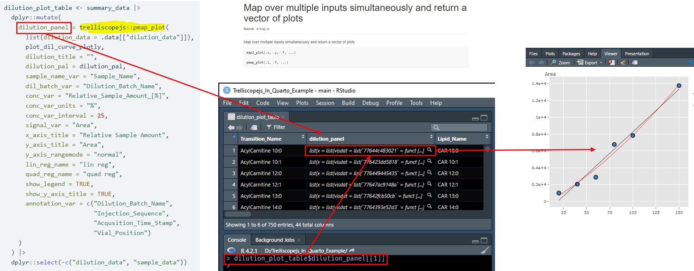
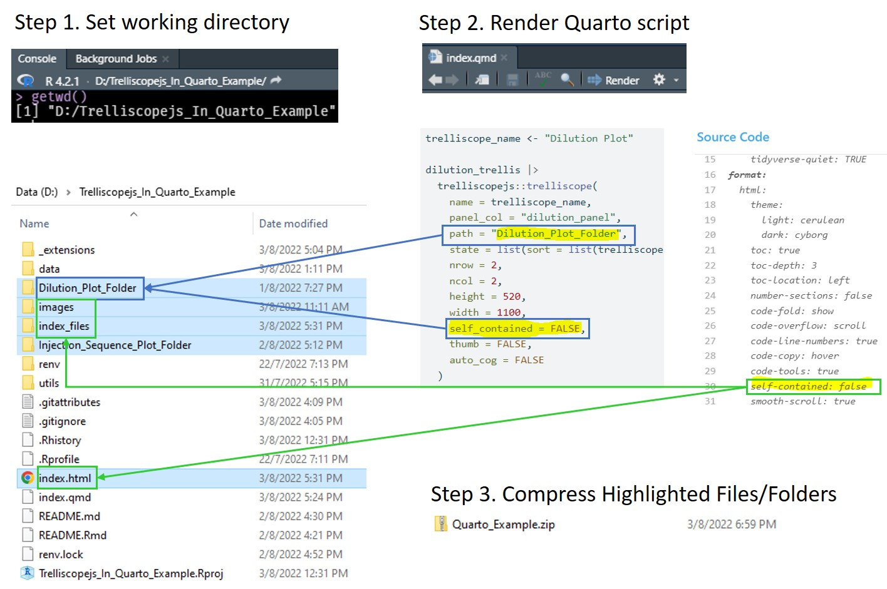
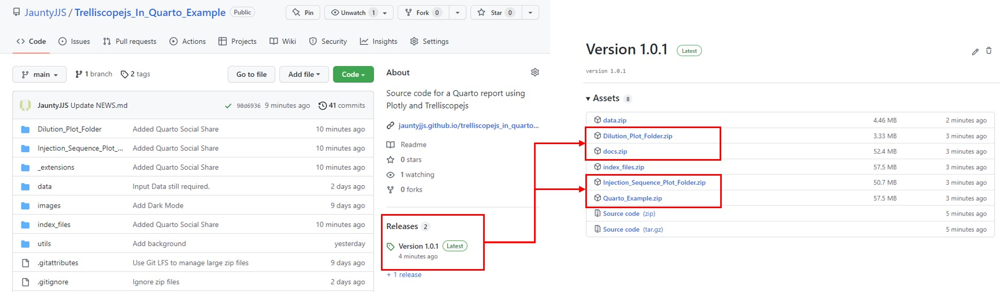

```{r setup, include=FALSE}
options(htmltools.dir.version = FALSE)
knitr::opts_chunk$set(echo = FALSE, fig.align = "center", out.width = "90%")
library(glue)
library(fontawesome)
library(metathis)
library(webshot2)
library(xaringanthemer)
library(xaringanExtra)
```


```{r screenshot, include=FALSE}
#' Screenshot Your Title Slide for Share Image
#'
#' Takes a screenshot of your title slide for sharing on Twitter
#' (and other social media sites).
#'
#' @param slides_rmd Your slides file
#' @param path Path to new share image
screenshot_share_image <- function(
  slides_rmd,
  path_image = "share-card.png"
) {
  if (!requireNamespace("webshot2", quietly = TRUE)) {
    stop(
      "`webshot2` is required: ", 
      'remotes::install_github("rstudio/webshot2")'
    )
  }
  
  webshot2::rmdshot(
    doc = slides_rmd,
    file = path_image,
    vheight = 600,
    vwidth = 600 * 191 / 100,
    rmd_args = list(
      output_options = list(
        nature = list(ratio = "191:100"),
        self_contained = TRUE
      )
    )
  )
  
  path_image
}

#screenshot_share_image("index.Rmd")
```


```{r xaringan-themer, include=FALSE, warning=FALSE}
xaringanthemer::style_mono_accent(
  base_color = "#3b1260",
  header_font_google = xaringanthemer::google_font("Josefin Sans", "300"),
  text_font_google   = xaringanthemer::google_font("Montserrat", "600", "600i"),
  code_font_google   = xaringanthemer::google_font("Fira Mono"),
  code_inline_color = "#0098db",
  inverse_link_color = "#bbf3dc",
  link_color = "#0072bb",
  footnote_color = NULL,
  footnote_font_size = "0.6em",
  footnote_position_bottom = "10px",
)
```

```{r metathis, echo=FALSE}
meta() %>%
  meta_name("github-repo" = "JauntyJJS/RMedicine2022") %>% 
  meta_social(
    title = "Viewing Multiple Inteactive Plots Using Plotly and Trelliscopejs",
    description = glue::glue("
    Presented at R/Medicine 2022. 
    "),
    url = "https://jauntyjjs.github.io/RMedicine2022",
    image = "https://raw.githubusercontent.com/JauntyJJS/RMedicine2022/main/share-card.png",
    image_alt = glue::glue("
      Title slide of Viewing Multiple Inteactive Plots Using \\
      Plotly and Trelliscopejs presented at R/Medicine 2022.
      "),
    og_type = "website",
    og_author = "Jeremy Selva",
    twitter_card_type = "summary_large_image",
    twitter_creator = "@JauntyJJS"
  )
```

```{r xaringanExtra-share-again, echo=FALSE}
# xaringanExtra::embed_xaringan(
#  url = "https://jauntyjjs.github.io/RMedicine2022",
#  ratio = "16:9"
# )
xaringanExtra::use_share_again()
```


class: middle, center, inverse

# Viewing Multiple Inteactive Plots Using [`plotly`](https://plotly.com/r/) and [`trelliscopejs`](https://hafen.github.io/trelliscopejs/)

.pull-left[
```{r, out.width = "53%"}

```

### R/Medicine 2022
]

.pull-right[
```{r, out.width = "100%"}

```

### Jeremy Selva [`r fa(name = "github")`](https://github.com/JauntyJJS) [`r fa(name = "linkedin")`](https://www.linkedin.com/in/jeremy-selva-085b9112a/) [`r fa(name = "link")`](https://jeremy-selva.netlify.app/) [`r fa(name = "twitter")`](https://twitter.com/JauntyJJS)

]

.left[
.footnote[

[Xaringan](https://github.com/yihui/xaringan) Slide Template by [Sharla Gelfand](https://github.com/sharlagelfand/sharstudioconf) [`r fa(name = "github")`](https://github.com/sharlagelfand) [`r fa(name = "link")`](https://sharla.online) [`r fa(name = "twitter")`](https://twitter.com/sharlagelfand) [`r fa(name = "youtube-square")`](https://www.youtube.com/watch?v=JThd3YYQXGg)
]
]

.center[.footnote[https://jauntyjjs.github.io/RMedicine2022 [`r fa(name = "file-pdf")`](https://jauntyjjs.github.io/RMedicine2022/index.pdf)]
]

---
## How Lipids are measured (Targeted Lipidomics)

```{r, out.width = "90%"}
knitr::include_graphics("images/Targeted_Lipidomics.JPG")
```

.center[.footnote[https://jauntyjjs.github.io/RMedicine2022 [`r fa(name = "file-pdf")`](https://jauntyjjs.github.io/RMedicine2022/index.pdf)]
]

---
## Source of "Unwanted" Variation
* Lipid Extraction
  * Different pipettes used to do extraction.
  
* Lipid Measurement
  * Contaminant ions
  
```{r, out.width = "90%"}

```

.center[.footnote[https://jauntyjjs.github.io/RMedicine2022 [`r fa(name = "file-pdf")`](https://jauntyjjs.github.io/RMedicine2022/index.pdf)]
]
---
## Quality Control (QC) Samples

Quality control samples helps to check the severity of unwanted variation. 

One example is the Batch Quality Control (BQC) to measure variation during lipid extraction and measurement.

```{r, out.width = "100%"}

```

.left[.footnote[Pooled sample image from [Broadhurst et. al. 2018](https://doi.org/10.1007/s11306-018-1367-3)]]

.center[.footnote[https://jauntyjjs.github.io/RMedicine2022 [`r fa(name = "file-pdf")`](https://jauntyjjs.github.io/RMedicine2022/index.pdf)]
]

---
## Quality Control Plot

An injection sequence bar chart with some statistical summary is created for each transition. Keep transitions with high BQC coefficient of variation (CV).

Report results as a pdf file of injection sequence bar charts. (One transition per page)

```{r, out.width = "90%"}
knitr::include_graphics("images/Injection_Sequence_Plot.JPG")
```

.left[.footnote[PDF image from [Wikimedia](https://commons.wikimedia.org/wiki/Category:PDF_icons)]]

.center[.footnote[https://jauntyjjs.github.io/RMedicine2022 [`r fa(name = "file-pdf")`](https://jauntyjjs.github.io/RMedicine2022/index.pdf)]
]

---
## Motivation for using [`plotly`](https://plotly.com/r/) and [`trelliscopejs`](https://hafen.github.io/trelliscopejs/)

Number of samples are getting larger (increase to few thousands).

Static bar charts and scatter plots will not work.

```{r, out.width = "100%"}

```

.center[.footnote[https://jauntyjjs.github.io/RMedicine2022 [`r fa(name = "file-pdf")`](https://jauntyjjs.github.io/RMedicine2022/index.pdf)]
]

---
## Motivation for using [`plotly`](https://plotly.com/r/) and [`trelliscopejs`](https://hafen.github.io/trelliscopejs/)

Number of transitions have increased to over $500$. This give a $> 500$-pages pdf file full of plots.

```{r, out.width = "100%"}
knitr::include_graphics("images/Motivation2.JPG")
```

.center[.footnote[https://jauntyjjs.github.io/RMedicine2022 [`r fa(name = "file-pdf")`](https://jauntyjjs.github.io/RMedicine2022/index.pdf)]
]

---
## Motivation for using [`plotly`](https://plotly.com/r/) and [`trelliscopejs`](https://hafen.github.io/trelliscopejs/)

Different QC sample types give rise to different plot type, resulting in .red[multiple] $> 500$-page.red[s] pdf files.

```{r, out.width = "100%"}

```

.left[
.footnote[
Images by [Amonrat Rungreangfangsai](https://www.vecteezy.com/members/amy1313)
]
]

.center[.footnote[https://jauntyjjs.github.io/RMedicine2022 [`r fa(name = "file-pdf")`](https://jauntyjjs.github.io/RMedicine2022/index.pdf)]
]

---

<p align="center">
<iframe width="1000" height="600" src="https://jauntyjjs.github.io/Trelliscopejs_In_Quarto_Supplementary1/"></iframe>
</p>

.center[.footnote[https://jauntyjjs.github.io/RMedicine2022 [`r fa(name = "file-pdf")`](https://jauntyjjs.github.io/RMedicine2022/index.pdf)]
]

---
## Quarto Example

Thanks to open science, I am able to create a walk through example using Quarto [`r fa(name = "link")`](https://jauntyjjs.github.io/Trelliscopejs_In_Quarto_Example/) [`r fa(name = "github")`](https://github.com/JauntyJJS/Trelliscopejs_In_Quarto_Example).

```{r, out.width = "90%"}
knitr::include_graphics("images/Open_Science.JPG")
```

.left[
.footnote[
Images from [Wolrab et. al 2022](https://doi.org/10.1038/s41467-021-27765-9)
]
]

.center[.footnote[https://jauntyjjs.github.io/RMedicine2022 [`r fa(name = "file-pdf")`](https://jauntyjjs.github.io/RMedicine2022/index.pdf)]
]

---
## Vector Of Plots

Use [`dplyr::mutate`](https://dplyr.tidyverse.org/reference/mutate.html) and [`trelliscopejs::pmap_plot`](https://hafen.github.io/trelliscopejs/reference/map2_plot.html) to save [`plotly`](https://plotly.com/r/) plots as a new column.

```{r, out.width = "100%"}

```

---
## Patching `plotly` Plots

Use [`manipulateWidget::combineWidgets`](https://cran.r-project.org/web/packages/manipulateWidget/vignettes/manipulateWidgets.html) and [`plotly::subplot`](https://plotly.com/r/subplots/) to patch different [`plotly`](https://plotly.com/r/) plots.

```{r, out.width = "100%"}
knitr::include_graphics("images/Combined_Plots.JPG")
```

.center[.footnote[https://jauntyjjs.github.io/RMedicine2022 [`r fa(name = "file-pdf")`](https://jauntyjjs.github.io/RMedicine2022/index.pdf)]
]

---
## `trelliscopejs` cognostics

Providing metadata information as `trelliscopejs` cognostics can help to improve the user experience. Refer to the Quarto [`r fa(name = "link")`](https://jauntyjjs.github.io/Trelliscopejs_In_Quarto_Example/) [`r fa(name = "github")`](https://github.com/JauntyJJS/Trelliscopejs_In_Quarto_Example) example on how to do it.

```{r, out.width = "80%"}

```

.center[.footnote[https://jauntyjjs.github.io/RMedicine2022 [`r fa(name = "file-pdf")`](https://jauntyjjs.github.io/RMedicine2022/index.pdf)]
]

---
## Results Distribution

To export a `trelliscopejs` object.

```{r, out.width = "75%"}

```

.center[.footnote[https://jauntyjjs.github.io/RMedicine2022 [`r fa(name = "file-pdf")`](https://jauntyjjs.github.io/RMedicine2022/index.pdf)]
]

---
## Results Distribution

To export a Quarto document with `trelliscopejs` object.

```{r, out.width = "80%"}

```

.center[.footnote[https://jauntyjjs.github.io/RMedicine2022 [`r fa(name = "file-pdf")`](https://jauntyjjs.github.io/RMedicine2022/index.pdf)]
]

---
## Results Distribution

Exported examples are found in the below [GitHub page](https://github.com/JauntyJJS/Trelliscopejs_In_Quarto_Example).

```{r, out.width = "90%"}

```

.center[.footnote[https://jauntyjjs.github.io/RMedicine2022 [`r fa(name = "file-pdf")`](https://jauntyjjs.github.io/RMedicine2022/index.pdf)]
]

---
## Enjoy The Conference

.pull-left[

Summary
- Quality control samples are useful to check for unwanted variation in a targeted lipidomics workflow.

- [`plotly`](https://plotly.com/r/) and [`trelliscopejs`](https://hafen.github.io/trelliscopejs/) can help to explore many interactive plots in an effective way.

- Hope that the Quarto [`r fa(name = "link")`](https://jauntyjjs.github.io/Trelliscopejs_In_Quarto_Example/) [`r fa(name = "github")`](https://github.com/JauntyJJS/Trelliscopejs_In_Quarto_Example) example and advice provided are useful.

]

.pull-right[
```{r, out.width = "100%"}
knitr::include_graphics("images/business-team.JPG")
```
]

.left[.footnote[
Images by [Amonrat Rungreangfangsai](https://www.vecteezy.com/members/amy1313)

[Xaringan](https://github.com/yihui/xaringan) Slide Template by [Sharla Gelfand](https://github.com/sharlagelfand/sharstudioconf) [`r fa(name = "github")`](https://github.com/sharlagelfand) [`r fa(name = "link")`](https://sharla.online) [`r fa(name = "twitter")`](https://twitter.com/sharlagelfand) [`r fa(name = "youtube-square")`](https://www.youtube.com/watch?v=JThd3YYQXGg)

]
]

.center[.footnote[https://jauntyjjs.github.io/RMedicine2022 [`r fa(name = "file-pdf")`](https://jauntyjjs.github.io/RMedicine2022/index.pdf)]
]
